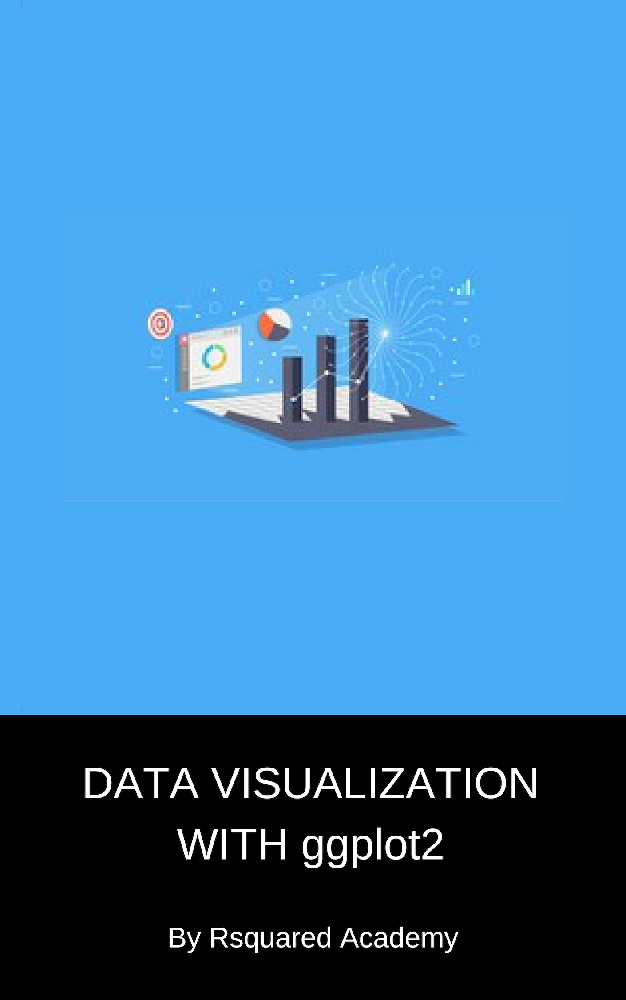

--- 
title: "Data Visualization with ggplot2"
author: "Aravind Hebbali"
date: "`r Sys.Date()`"
site: bookdown::bookdown_site
documentclass: book
link-citations: yes
description: "Learn to visualize data with ggplot2."
---

# Preface {-}

```{r fig.align='center', echo=FALSE, out.width="60%"}

```

<a rel="license" href="http://creativecommons.org/licenses/by-nc-sa/4.0/"></a><br />This work is licensed under a <a rel="license" href="http://creativecommons.org/licenses/by-nc-sa/4.0/">Creative Commons Attribution-NonCommercial-ShareAlike 4.0 International License</a>.

## Software information {-}

The R session information when compiling this book is shown below:

```{r session}
sessionInfo()
```

We do not add prompts (`>` and `+`) to R source code in this book, and we comment out the text output with two hashes `##` by default, as you can see from the R session information above. This is for your convenience when you want to copy and run the code (the text output will be ignored since it is commented out). Package names are in bold text (e.g., **rmarkdown**), and function names are followed by parentheses (e.g., `bookdown::render_book()`). The double-colon operator `::` means accessing an object from a package. 